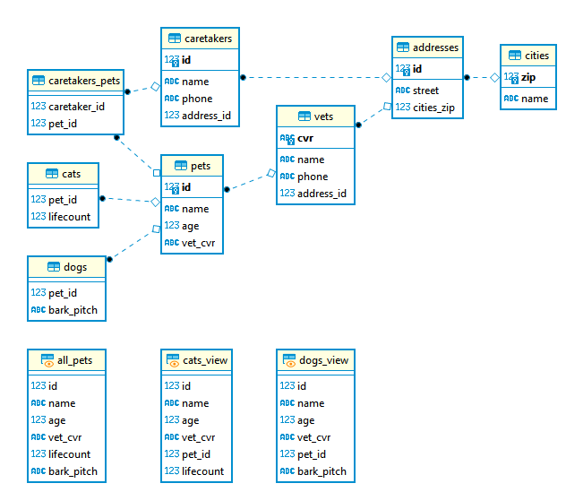

# DBD assignment 1
## Relationelle databaser m. PostGreSQL.

#### Mads Wulff Nielsen cph-mn492@cphbusiness.dk
#### Claus Kramath cph-ck83@cphbusiness.dk

##### Valg af strategi
Vi har valgt at implementere arv i databasen vha. joined tables strategien, da den ligger relativt tæt på det objektorienterede paradigme. Herudover giver den os mulighed for at etablere stored procedures til brug v. indsættelse af nye tupler i databasen.

##### Implementation på det konceptuelle niveau
Tabeller oprettes i [tables.sql](tables.sql)
Dummy data indsættes i [data.sql](data.sql)

##### Implementation på det eksterne niveau
Sammenkædning af pets, cats og dogs til et single-table view (se ER diagram) oprettes i [views.sql](views.sql)
Procedure til indsættelse af nye data i pets, cats og dogs tabellerne oprettes i [stored_procedures.sql](stored_procedures.sql)
Brugerrettigheder tildeles i [users_and_rights.sql](users_and_rights.sql)

##### Interface implementation
Applikationen findes i [vetapp](https://github.com/CK2800/dbd/tree/main/1/vetapp)
