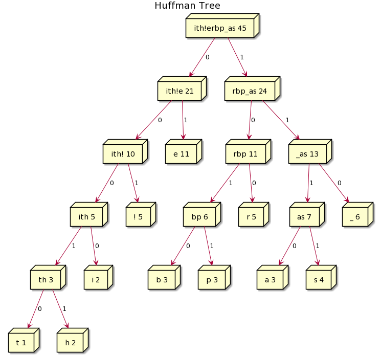
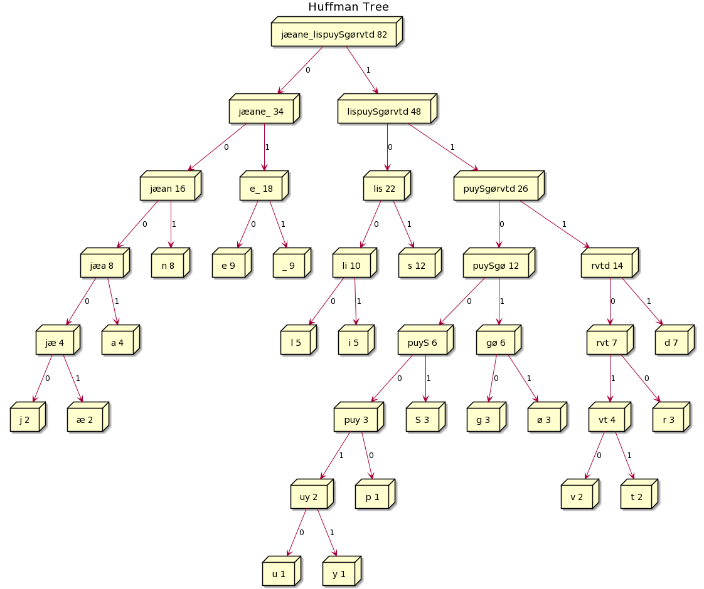

# Task 1 - Inv01stigation

## Hvorfor NoSQL databaser?

- Med NoSQL databaser behøver vi ikke at definere et DB Schema på forhånd. NoSQL er dermed mindre rigidt end relationelle databaser; ændringer kan godt foretages senere.  
  Disse er dog selvsagt krævende ved meget store datamængder, som netop er et kendetegn ved brugen af NoSQL databaser.

- NoSQL databaser kan distribueres og kan dermed håndtere nedetid; er en instans nede, kan en anden tage over.
- NoSQL databaser er nemmere at skalere horisontalt, dvs. over flere maskiner.
- Er gode til ekstremt store datamængder.

## Hvad siger CAP sætningen (CAP Theorem)?

Lad os først se hvad CAP betyder:

- C for Consistency  
  _Every read receives the most recent write OR an error._  
  Hvis data ikke kan garanteres at være _most recent_ ELLER hvis fejl, f.eks. på netværket, optræder, vil systemet returnere en fejl.
- A for Availability  
  _Every request receives a (non-error) response (but may not contain the most recent data!)_  
  Systemet er altid tilgængeligt men KAN returnere _stale data_.
- P for Partition tolerant  
  _The system continues to operate despite an arbitrary number of messages being dropped (or delayed) by the network between nodes._

Sætningen siger: _Det er umuligt for et distribueret database system at yde mere end 2 af de 3 garantier samtidig._

Så når en fejl på en netværkspartition optræder, må vi vælge mellem:

1. at afbryde operationen og således slække på _availability_ af hensyn til _consistency_.
2. at fortsætte operationen og således risikere _inconsistency_ af hensyn til _availability_.  
   Bemærk her, at valget først skal træffes, når fejl på netværkspartioner opstår, dvs. når det distribuerede system kører normalt, kan både _availability_ og _consistency_ opfyldes.

## Hvad er ideelle brugsmønstre for HBase?

- Store datamængder, gerne talt i høje GB eller TB+
- Distribuerede partitioner, ikke under 5 noder i et cluster.
- Telefonselskaber som lagrer opkaldshistorik mv.
- Banker som lagrer kontobevægelser.
- Indekseringstjenester som scraper nettet.
- Streamingtjenester.
- Content delivery tjenester.
- Sociale netværk.

# Task 2 - Bloom filters

## 1. Hvad er et Bloom filter?

- En smart datastruktur (bit array) som kan bruges til at tjekke, om et objekt er i et sæt (f.eks. en fil på en server).
- Datastrukturen KAN give false positives, derfor er et positivt svar et udtryk for en sandsynlighed for at en server har en bestemt fil.
  Opleves en høj rate af false positives, må man udvide antallet af bits i datastrukturen. Antallet i udvidelsen kan beregnes således:

          1.44 * log2(1/0.05) // v. accept af 5% false positives.

- Datastrukturen KAN IKKE give false negative.

## 2. Hvad er fordelen(e) ved Bloom filters ift. hash tables?

- Pladsforbrug.  
  Bloom filteret lagrer ikke selve objektet det peger på.
- Færre disk reads.  
  Bloom filteret er potentielt så småt, at det kan lagres i RAM. Hvis en fil skal findes, kan man med sikkerhed få at vide, hvis den ikke findes på en given server, ved at læse fra RAM.  
  Hvis samme operation skal ske med en stor hash-tabel, som delvist er lagret på disken, vil den kræve flere disk reads.

## 3. Hvad er bagdele ved Bloom filters?

- De kan give false positives.
- Man kan ikke fjerne elementer fra Bloom filteret igen.
- De kan ikke give data tilbage, kun tilkendegive om de muligvis findes.
- Man må holde styr på raten af false positives og udvide filteret tilsvarende.

## 4. Implementation af Bloom filter

- Se [ass2.ipynb](ass2.ipynb)

## 5. Pladsforbrug v. 1 mio. ASCII strings i Java Hashset

- Alle strings er i gennemsnit 10 karakterer.
- Vi antager at alle karaktererne bruger UTF-16 encoding, dvs. 16 bits pr. karakter.
- Regnestykket bliver: 1 mio strings _ 10 karakterer _ 16 bits = 160.000.000 bits => 20.000.000 bytes ~ 19.532 KB ~ 19,08 MB ~ 14 :floppy_disk:, ouch!

- Dog er det værd at nævne, at vi ikke ved præcis hvordan et HashSet lagrer værdier. Der er således et overhead i form af:
  int keyhash, Object next, Object key, Object value.
  Så vores estimat er ret optimistisk.

## 6-8. Algoritme for udregning af Bloom filter størrelse og bitkrav.

- 1.44 _ log2(1/_&euro;\*) hvor € angiver fejlraten (false positives) i %.
- 1.44 \* log2(1/0.01) ~ 9.567 bits pr. element v. 1%.
- 1.44 \* log2(1/0.05) ~ 6.224 bits pr. element v. 5%.

## 9. Bitkrav for 10 mio. karakterer v. 5% fejlrate.

- 1.44 _ log2(1/0.05) _ 10.000.000 ~ 62.240.000 bits ~ 7.780.000 bytes ~ 7.598 KB ~ 7,4 MB ~ 5 :floppy_disk:

# Task 3 - Huffman coding

## 1. Lav Huffman code og Huffman træ.

- Flg. sætning skal bruges: "_beebs beepps!!!!! their eerie ears hear pears_"  
  De 45 tegn fordeler sig således:

  | tegn | antal | Huffman |
  | :--: | :---: | :-----: |
  |  t   |   1   |  00010  |
  |  h   |   2   |  00011  |
  |  i   |   2   |  0000   |
  |  b   |   3   |  1010   |
  |  p   |   3   |  1011   |
  |  a   |   3   |  1110   |
  |  s   |   4   |  1111   |
  |  !   |   5   |   001   |
  |  r   |   5   |   100   |
  |  \_  |   6   |   110   |
  |  e   |  11   |   01    |

- Herunder ses Huffman træet:
  

## 2. Bitlængder før og efter.

- Før: 8 bit/tegn \* 45 tegn = 360 bits.
- Efter: 145 bits: 1010010110101111110101001011011101111110010010010010011100001000011010000100110010110000000111001111010011111100001101111010011010110111101001111

## 3. Pete is here.

101101000100111000001111110000110110001

## 4. Huffman encode egen sætning.

- "_Salige Søren Sivertsen sejlede sin sædvanlige søndagstur sønden sjællands sydspids_"

  | tegn | antal | Huffman |
  | :--: | :---: | :-----: |
  |  u   |   1   | 1100010 |
  |  y   |   1   | 1100011 |
  |  p   |   1   | 110000  |
  |  v   |   2   | 111010  |
  |  t   |   2   | 111011  |
  |  j   |   2   |  00000  |
  |  æ   |   2   |  00001  |
  |  S   |   3   |  11001  |
  |  g   |   3   |  11010  |
  |  ø   |   3   |  11011  |
  |  r   |   3   |  11100  |
  |  a   |   4   |  0001   |
  |  l   |   5   |  1000   |
  |  i   |   5   |  1001   |
  |  d   |   7   |  1111   |
  |  n   |   8   |   001   |
  |  e   |   9   |   010   |
  |  \_  |   9   |   011   |
  |  s   |  12   |   101   |

- Herunder ses Huffman træet:
  
# Task 4 - Map and reduce.
## 1. Map liste af tal til liste af kvadratrødder.
-     [1,2,3,4].map(tal => Math.pow(tal,2))
## 2. Listens ord skal wrappes i \<h1>-tags.
-     ["Intro", "Requirements", "Analysis", "Implementation", "Conclusion", "Discussion","References"].map(str => "<h1>".concat(str).concat("</h1>"))
## 3. Uppercase alle bogstaver i listens ord.
-     ["i’m", "yelling", "today"].map(word => word.toUpperCase()) // Array(3) [ "I’M", "YELLING", "TODAY" ]
## 4. Ordets længde.
-     ["I", "have", "looooooong", "words"].map(word => word.length) // Array(4) [ 1, 4, 10, 5 ]

## 5. comics.json billeder i \-tags.
-     comics.map(comic => ""))
-     comics.map(comic => ".concat(")"))).reduce((acc,cur) => acc+cur) // MD! friendly.

## 6. Udregn arrays sum.
-     [1,2,3,4,5].reduce((acc,cur) => acc+cur)
## 7. Udregn sum af x i arrayets elementer.
-     [{x: 1},{x: 2},{x: 3}].reduce((acc, cur) => ac = (isNaN(acc) ? acc.x : acc) + cur.x)
-     [{x: 1},{x: 2},{x: 3}].map(item => item.x).reduce((acc, cur) => acc + cur)
## 8. Flatten et array af arrays.
-     [[1,2],[3,4],[5,6]].reduce((acc,cur) => acc.concat(cur))
-     [[1,2],[3,4],[5,6]].flat()
## 9. Reducer array til kun positive tal.
-     [-3, -1, 2, 4, 5].reduce((acc, cur) => {typeof(acc) === "number" ? acc > 0 ? acc = [acc] : acc = [] : cur > 0 ? acc.push(cur) : undefined; return acc}) // lidt dirty

