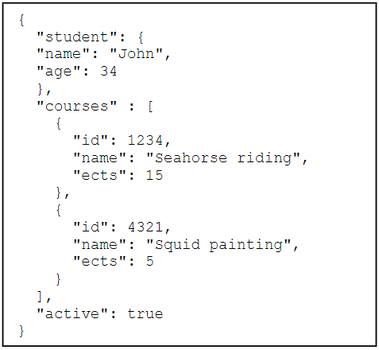

# Learn EDMA

## A JSON example.



## Create a meta model for JSON.

    // simple typer.
    ValueDomain JSONObject : String[1..MAX] // vi antager at object repræsenteres v. strenge.
    ValueDomain JSONString : String[MIN..MAX] // tomme strenge ok
    ValueDomain JSONNumber : Integer[MIN..MAX]
    ValueDomain JSONFloat : Float[MIN..MAX]
    ValueDomain JSONBoolean : Boolean
    ValueDomain JSONNull : String[4] Constraints[isNull]

    // JSON element typer
    ValueDomain ELEMENTKey : String[1..MAX]
    ValueDomain ELEMENTValue : OneOf<OBJECTS, JObject, JSONString, JSONNumber, JSONFloat, JSONBoolean, JSONNull>
    ValueDomain ELEMENTS : List<ELEMENT>
    ValueDomain OBJECTS : List<JObject>
    ValueDomain ELEMENT : Struct
    {
        key : ELEMENTKey,
        value : ELEMENTValue
    }

    // JSON object (parent)
    ValueDomain JObject : Struct
    {
        elements : ELEMENTS
    }

## Code to create the example JSON object.

    // Create John
        ELEMENT name = ELEMENT.create().key("name").value(ELEMENTValue.create(JSONString.create("John")));
        ELEMENT age = ELEMENT.create().key("age").value(ELEMENTValue.create(JSONNumber.create(34)));
        ELEMENTS johnsElements = ELEMENTS.begin().add(name).add(age).end();
        JObject john = JObject.create().elements(johnsElements);
        ELEMENT student = ELEMENT.create().key("student").value(ELEMENTValue.create(john));

        // Create Seahorse riding course
        ELEMENT sr_id = ELEMENT.create().key("id").value(ELEMENTValue.create(JSONNumber.create(1234)));
        ELEMENT sr_name = ELEMENT.create().key("name").value(ELEMENTValue.create(JSONString.create("Seahorse riding")));
        ELEMENT sr_ects = ELEMENT.create().key("ects").value(ELEMENTValue.create(JSONNumber.create(15)));
        ELEMENTS seahorseRidingElements = ELEMENTS.begin().add(sr_id).add(sr_name).add(sr_ects).end();
        JObject seahorseRiding = JObject.create().elements(seahorseRidingElements);

        // Create Squid painting course
        ELEMENT sp_id = ELEMENT.create().key("id").value(ELEMENTValue.create(JSONNumber.create(4321)));
        ELEMENT sp_name = ELEMENT.create().key("name").value(ELEMENTValue.create(JSONString.create("Squid painting")));
        ELEMENT sp_ects = ELEMENT.create().key("ects").value(ELEMENTValue.create(JSONNumber.create(5)));
        ELEMENTS squidPaintingElements = ELEMENTS.begin().add(sp_id).add(sp_name).add(sp_ects).end();
        JObject squidPainting = JObject.create().elements(squidPaintingElements);

        // Create list of courses.
        OBJECTS courseObjects = OBJECTS.begin().add(seahorseRiding).add(squidPainting).end();
        ELEMENT courses = ELEMENT.create().key("courses").value(ELEMENTValue.create(courseObjects));

        // Create boolean.
        ELEMENT active = ELEMENT.create().key("active").value(ELEMENTValue.create(JSONBoolean.create(true)));


        // Create parent element
        ELEMENTS parentElements = ELEMENTS.begin().add(student).add(courses).add(active).end();
        JObject parent = JObject.create().elements(parentElements);

## Resulting JSON output.

```yaml
{
  "student": { "name": "John", "age": 34 },
  "courses":
    [
      { "id": 1234, "name": "Seahorse riding", "ects": 15 },
      { "id": 4321, "name": "Squid painting", "ects": 5 },
    ],
  "active": true,
}
```

## How to use:

1. Download Learn_EDMA folder and open in IntelliJ.
2. Run main method in Make.java in EDMA_GENERATE module.
3. Run main method in Play.java located in src.dk.ck.learnedma package.
4. Verify the output in the console, it should resemble the JSON above.
