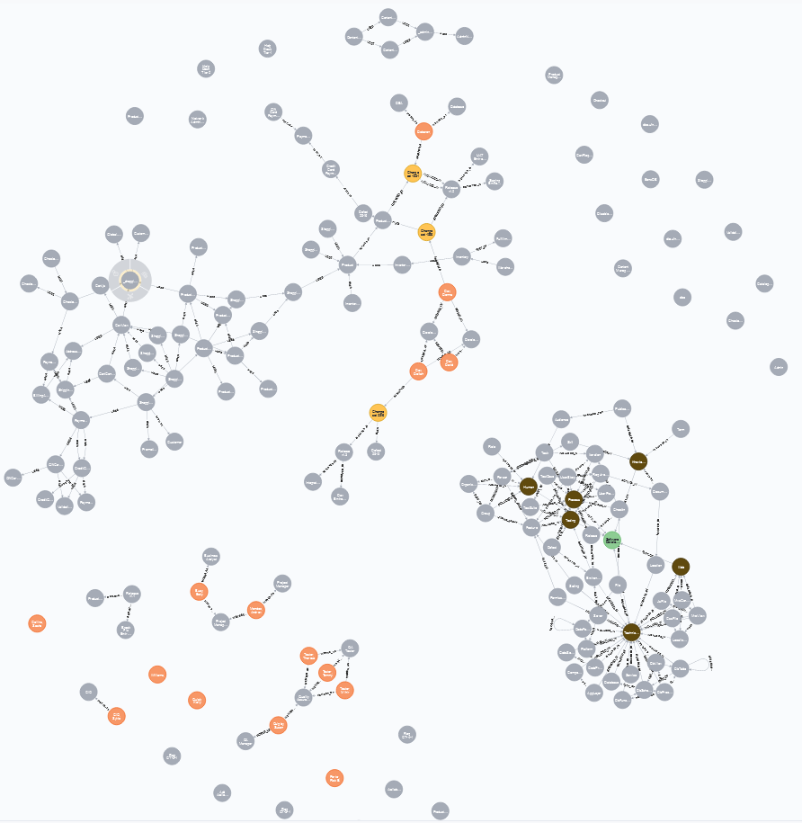
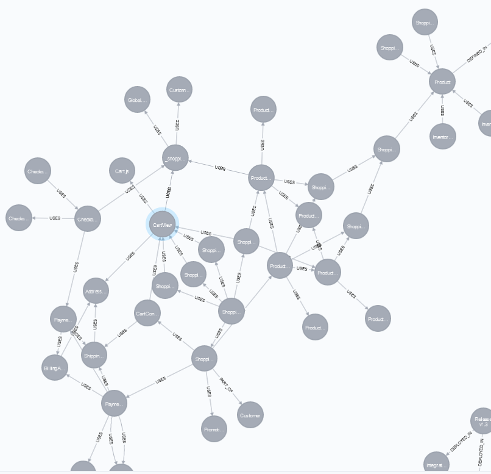

# Assignment 4

## Klient til at forbinde til neo4j database:

1.  Start docker og kør docker-compose.yml for at få et neo4j cluster med 4 core replicas og et read replica.
1.  Download neo4jclient mappen og ændr forbindelsesindstillingerne i:
    /src/main/resources/application.properties
1.  Start din neo4j
1.  Kør Neo4jclientApplication.main og observer at der indsættes en node i databasen og der returneres en besked i konsollen.
1.  Opret database i browseren ved først at skifte til system databasen:

        :use system;

1.  Opret nu database ved at udføre flg.:

        CREATE DATABASE 'sdm';

1.  Indsæt data i sdm-databasen ved at køre scriptet i sdm_data.txt.
    Dette giver flg.:
    

# Statistik forespørgsler

## Hvor mange procent af Persons er i en Group?

    MATCH (p:Person) WITH count(p) as persons MATCH(pog:Person) WHERE NOT (pog)-[]-(:Group) return toFloat(count(pog))/persons;

## Hvor mange procent af ikke-tilknyttede noder er features:

    MATCH (dims) WHERE NOT (dims)-[]-() WITH count(dims) as dimser MATCH (f:Feature) WHERE NOT (f)-[]-() RETURN (toFloat(count(f))/dimser) * 100;

# GDS forespørgsler

## Lav en graf over alle noder der er i en USES relation:

    CALL gds.graph.create.cypher('myGraph','MATCH(n) RETURN id(n) as id','MATCH (n)-[:USES]-(m) RETURN id(n) AS source, id(m) AS target');

## Hvilken node i en USES relation har højst page rank:

    CALL gds.pageRank.stream('myGraph') YIELD nodeId, score return gds.util.asNode(nodeId).name as name, score ORDER BY score DESC;

### Drop grafen:

    CALL gds.graph.drop('myGraph')

## Lav en graf for NodeDomain noder i en INCLUDED_IN relation, hvor retningen er ligegyldig:

    CALL gds.graph.create('myGraph','NodeDomain',{INCLUDED_IN:{orientation:'undirected'}} );

## Hvilken NodeDomain node er vigtigst jf. page rank:

    CALL gds.pageRank.stream('myGraph') YIELD nodeId, score return gds.util.asNode(nodeId).name as name, score;

### Drop grafen:

        CALL gds.graph.drop('myGraph')

## Opret graf med node types i INCLUDED_IN relationer, hvor retningen er ligegyldig:

    CALL gds.graph.create('myGraph','NodeType',{INCLUDED_IN:{orientation:'undirected'}} );

## Find communities blandt disse NodeTypes:

    CALL gds.louvain.stream('myGraph') YIELD nodeId, communityId, intermediateCommunityIds

RETURN gds.util.asNode(nodeId).name AS name, communityId, intermediateCommunityIds
ORDER BY name ASC;

### Drop grafen:

        CALL gds.graph.drop('myGraph')

## Lav en graf over alle de noder der er i en USES relation, cha. gds cypher:

    CALL gds.graph.create.cypher('myGraph','MATCH(n) RETURN id(n) as id','MATCH (n)-[:USES]-(m) RETURN id(n) AS source, id(m) AS target');

## Hvilken node i en USES relation, er vigtigst, jf. page rank:

    CALL gds.pageRank.stream('myGraph') YIELD nodeId, score return gds.util.asNode(nodeId).name as name, score ORDER BY score DESC;

| name              | score              |
| ----------------- | ------------------ |
| CartView          | 2.3275018314598124 |
| Product           | 2.1669275884982198 |
| PaymentController | 1.9427426934009422 |
| LocalizationKey   | 1.8503564485814423 |
| ProductListView   | 1.835328205116093  |
| ...               | ...                |

Ovenstående viser, at CartView er den node i en USES relation, der vægtes højst af page rank algoritmen.

