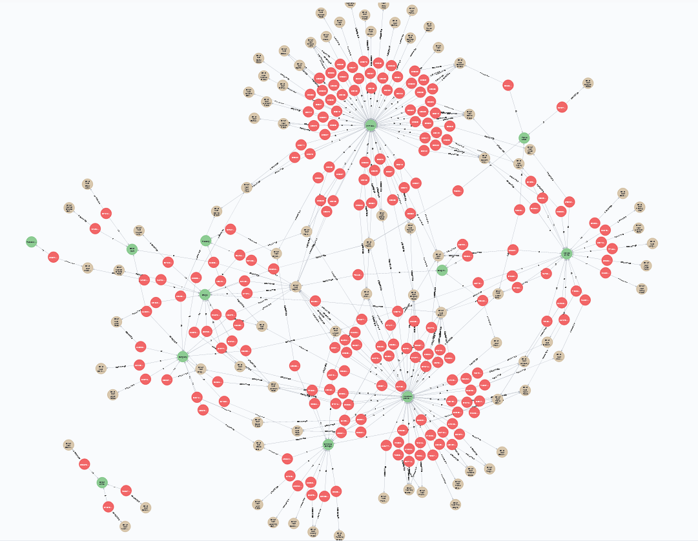

# Street crimes projekt

## Instruktioner:

Projektet er udarbejdet med en neo4j instans i en docker container.  
For at kunne læse en csv-fil ind fra det lokale filsystem, skal man mounte en mappe til den virtuelle import-mappe i den kørende docker-container.  
Flg. kommando kan bruges:

        docker run -e NEO4J_AUTH=none -p 7474:7474 -p 7687:7687 -v c:/neo4jtest/plugins:/plugins -v c:/neo4jtest/import:/var/lib/neo4j/import neo4j:latest

Nu kan csv-filen placeres i c:/neo4jtest/import mappen.  
(Hvis du vil have et responsivt system, er det smart at prøve med den begrænsede data-fil først: 2021-02-metropolitan-street_1000.csv)

Åbn neo4j browseren og kør flg. kommando for at indlæse filen:

        LOAD CSV WITH HEADERS FROM 'file:///2021-02-metropolitan-street_1000.csv' AS line
        CREATE (crime:Crime {id:line.`Crime ID`})
        MERGE (type:Type {type:line.`Crime type`})
        MERGE (location:Location {location:line.Location })
        CREATE (crime)-[a:COMMITTED]->(location)
        CREATE (crime)-[b:IS]->(type)

Under indlæsningen oprettes en Crime-node for hver linje.  
MERGE sørger for at oprette en Type-node hvis der ikke findes en med samme Crime Type allerede. Det samme er gældende for Location-noderne.

Flg. kommando viser grafen:

        MATCH (n) RETURN n

Af grafen ses, at der er et par tydelige kandidater til hyppigst forekommende kriminalitetstyper (grønne noder).

For at finde den hyppigste, skrives flg. kommando:

        MATCH(type:Type)-[a:IS]-(c:Crime) RETURN type, COUNT(DISTINCT(a)) as count ORDER BY count DESC LIMIT 1

På samme måde kan hyppigst forekommende sted findes:

        MATCH(location:Location)-[a:COMMITTED]-(c:Crime) RETURN location, COUNT(DISTINCT(a)) as count ORDER BY count DESC LIMIT 1
